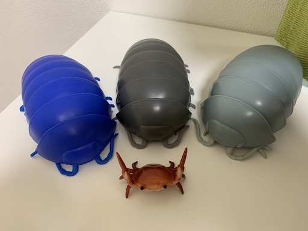

# This is an H1

## This is an H2

### This is an H3

#### This is an H4

##### This is an H5

###### This is an H6

Block Text

> Email-style angle brackets are used for blockquotes.
>
> > You can also nest them.
>
> - You can quote a list.
> - Etc.

> To break the nested blockquote, add a space between lines.

Footnote Text[^1]

[^1]: Footnote

Definition Term, Definition

First Term
: This is the definition of the first term.

Second Term
: This is one definition of the second term.
: This is another definition of the second term.

Caption
 [example](http://example.com "Caption")

Table Caption

| TitleA | TitleB | TitleC |
|:-|:-:|-:|
| ColumnA | ColumnB | ColumnC |

Image Caption

